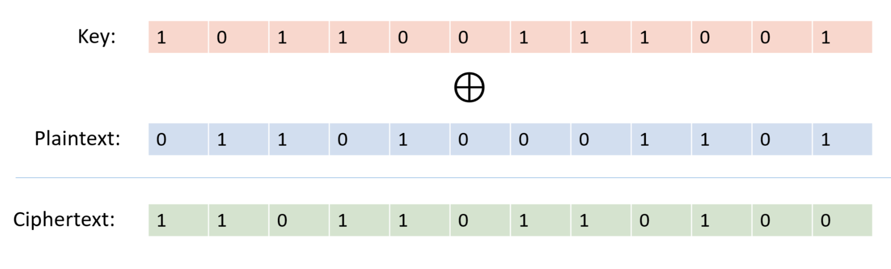

<h1 align="center">Breaking Many Time Pad</h1>
<h3 align="center">A solution to many time pad attack</h3>

## What is One Time Pad
In cryptography, a one-time pad is a system in which a private key generated randomly is used only once to encrypt a message that is then decrypted by the receiver using a matching one-time pad and key. Messages encrypted with keys based on randomness have the advantage that there is theoretically no way to "break the code" by analyzing a succession of messages.

  

## What is Many Time Pad
Many Time Pad is when a single key is used to encrypt many messages.

### But the resultant ciphers can be analysed and be decrypted to get all the messages and the key.
